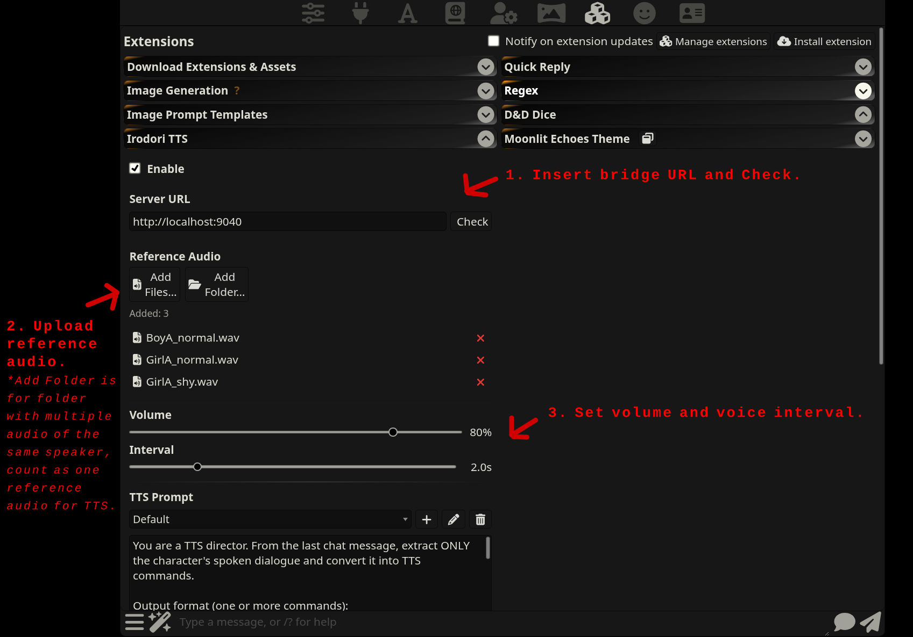
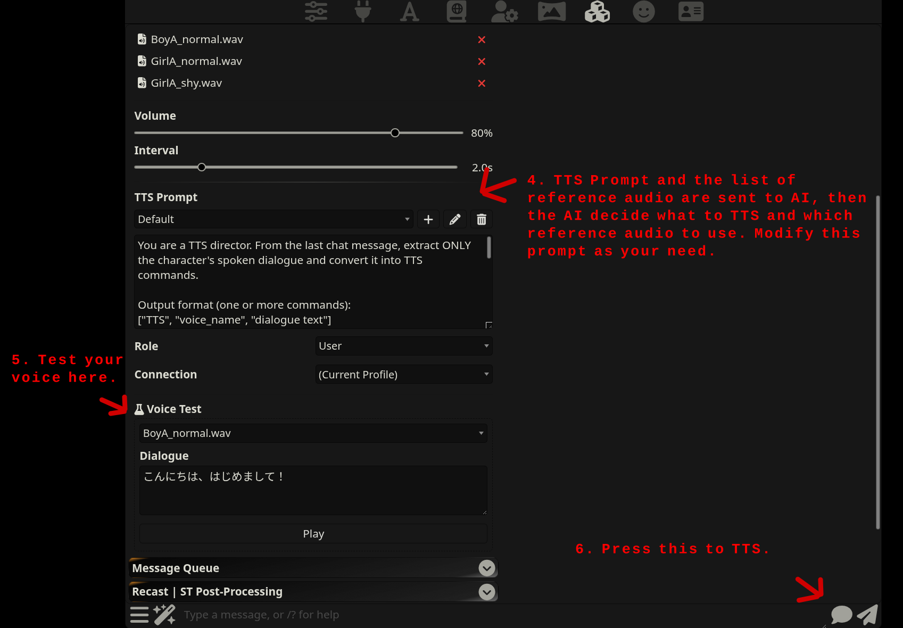

[日本語](README_JP.md) 

# SillyTavern-IrodoriTTS

AI powered Multi-voice TTS which use [Irodori-TTS](https://github.com/Aratako/Irodori-TTS) voice cloning.

**Feature:**
- Easy to use.
- Use multiple reference voice.
- AI decide what reference voice will be used in each dialogue(you can modify the TTS Prompt)
- One click, all dialogue of the last message are spoken as each character/voice-tone. 
- Runs voice cloning while speaking, so you don't have to wait on the interval.
- You can run the TTS server on vastai/runpod, so you don't need a GPU.

**IrodoriTTS is a Japanese good TTS, not tested in other language.*


# Install
**Tested on Linux, if you have any issue try giving this repo to AI and ask.*

**1. Install IrodoriTTS**<br />
Because of isolation, you may prefer to install in a Docker/Podman container but this is not mandatory.
```
# Create a container
podman run -d --device nvidia.com/gpu=all --name irodori-tts --network=host ubuntu:24.04 sleep infinity

# Make sure the GPU are working
nvidia-smi

# Upgrade the system, install what you need, create a user account to install/run the server.
```

Install [Irodori-TTS](https://github.com/Aratako/Irodori-TTS) and make sure are working.


**2. Install st-irodori-bridge**<br />
Install [st-irodori-bridge](https://github.com/myonmu0/st-irodori-bridge), this is a bridge which connect ST with Irodori-TTS.
```
# Install
git clone https://github.com/myonmu0/st-irodori-bridge

# Run
cd /path/to/your/Irodori-TTS
. .venv/bin/activate
cd /path/to/your/st-irodori-bridge
python3 ./st-irodori-bridge.py -v --irodori-dir /path/to/your/Irodori-TTS --host 127.0.0.1 --port 9040
```

Note: This bridge are intend to be only accessed by local user(set 127.0.0.1 or make sure only you can access) If you will run on Vastai/Runpod, don't open a port, instead use SSH Tunnel so only you can access. 

**3. Install SillyTavern-IrodoriTTS**<br />
SillyTavern > Extensions > Install extension > copy&paste this github url and install.


# How to use

**1. Make your reference voice**<br />
First you will need a reference audio, an clear voice of the character without BGM, about 10 second audio works fine.

Here are some usefull tools for this: 

- https://github.com/tsurumeso/vocal-remover

- **kdenlive** for cutting and saving the audio, you can put the video/audio on time line, navigate where the good voice is, press "i" let play then press "o" in the end of that voice, so the voice part are selected, then CTRL + ENTER, choose "selected" and "audio only" then save to a file.

Rename the reference file like the follow: Alice_normal.wav, Bob_normal.wav, Bob_joy.wav

**2. Configure**<br />

 <br />


**Note:**
- Don't forget to run the bridge.
- Uploaded reference audio will clear after reloading the browser.
- Only Chat Completion are supported. 


**3. Run TTS**<br />
Load a chat, press the "Run TTS" button and wait. 

Common issue:
- Connection error: Make sure the TTS server and the bridge are working.
- AI Fail to create the TTS: Make sure "Max Response Length (tokens)" is high enough, try using a stronger model(GLM or DeepSeek new one are cheap and good), try Thinking mode, try different model, change Role to User/System. You can see in the terminal running SillyTavern the TTS Prompt sent and the answer of the AI.
- It play, but voice don't match: Rename the reference audio to match the character name of the story, or edit the TTS Prompt to do what you want.
- Bad voice: Reference audio may be bad, if you press F12 and open DevTools you can see the reference audio used, you can go to "Voice Test" field and test, if not good make a new one.


Enjoy ;)


