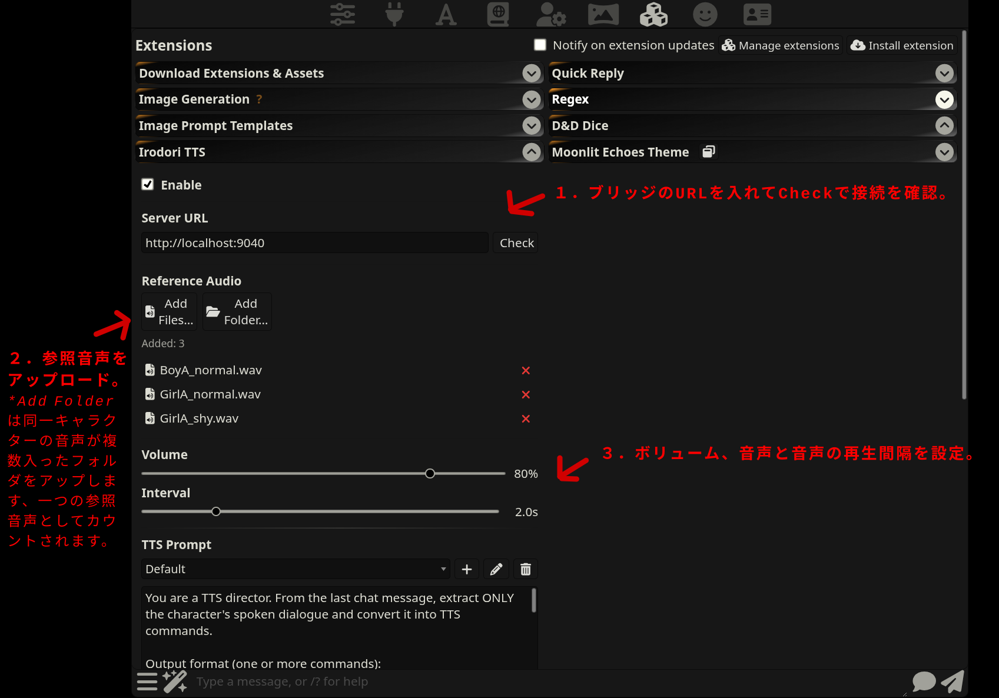
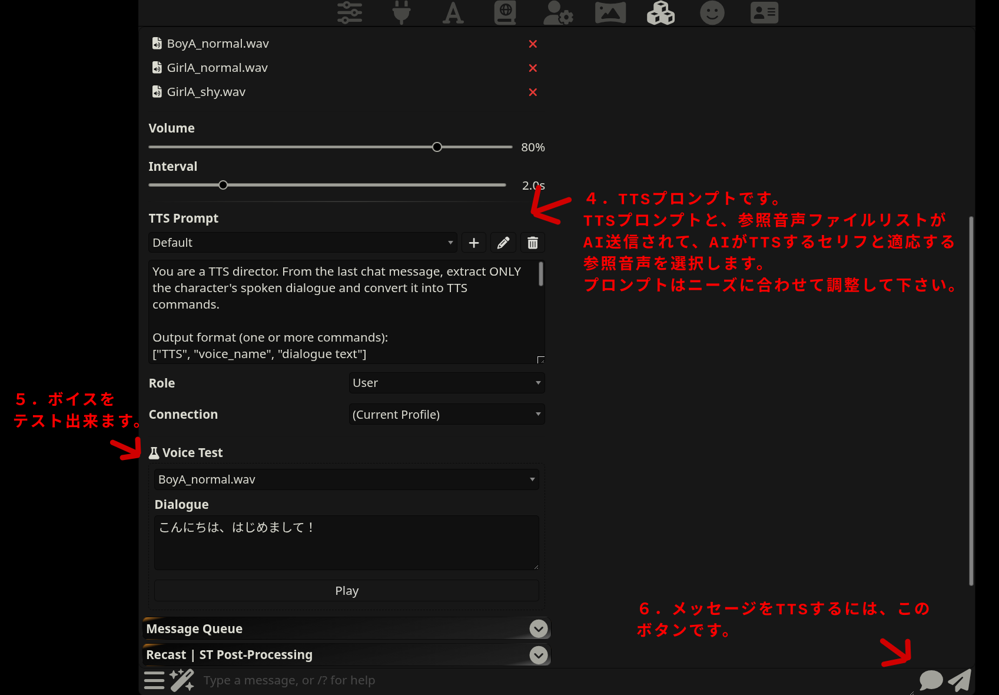

[English](README.md) 

# SillyTavern-IrodoriTTS

SillyTavernから[Irodori-TTS](https://github.com/Aratako/Irodori-TTS)のボイスクローンを利用する為のExtensionです。<br />
AIがセリフを抽出し各セリフに相応しい参照音声を選択します、複数のキャラクターが次々と喋ります！

**特徴:**
- シンプルな使い心地
- キャラクターの声として、数秒〜数十秒の参照音声を使用する
- 参照音声は好きな数だけ使用できる
- ワンクリックで、最終メッセージのセリフが全てそれぞれのキャラクター・声のトーンで再生
- 音声が再生されている間もボイスクローンを続ける事で、ボイスとボイスの間の待ち時間が無くなります
- Vastai/RunpodでTTSサーバーを動かせばGPUは不用です


# インストール
**Linux環境でテストしています、不明点や問題が起こった場合はこのリポジトリをAIに投げて質問すると解決するかもしれません。*

**1. IrodoriTTSをインストール**

AI関連のものは隔離性があると色々と良いので、Docker/Podmanコンテナの中でのインストールをおすすめしますが、これは必須ではありません。
```
# コンテナを作成します、おおよそ以下のようなコマンドになります。
podman run -d --device nvidia.com/gpu=all --name irodori-tts --network=host ubuntu:24.04 sleep infinity

# GPUが利用できる事を確認します。
nvidia-smi

# システムをアップデート、必要なものがあればインストール、TTSサーバーを動かす為のuserアカウントを作成する。
```

では、[Irodori-TTS](https://github.com/Aratako/Irodori-TTS)をインストールし正常に動いている事を確認して下さい。


**2. st-irodori-bridgeをインストール**<br />
[st-irodori-bridge](https://github.com/myonmu0/st-irodori-bridge)はSillyTavernとIrodori-TTSを繋げる為のブリッジです。
```
# インストール
git clone https://github.com/myonmu0/st-irodori-bridge

# 起動
cd /path/to/your/Irodori-TTS
. .venv/bin/activate
cd /path/to/your/st-irodori-bridge
python3 ./st-irodori-bridge.py -v --irodori-dir /path/to/your/Irodori-TTS --host 127.0.0.1 --port 9040
```

*注意：このブリッジはローカルアクセス前提で作られていますので、ネット上の不特定多数がアクセス出来ないようにローカルで（127.0.0.1など）動かして下さい。Vastai/Runpodで動かす場合はポートを開かずにSSHトンネル経由で利用して下さい。*

**3. SillyTavern-IrodoriTTSをインストール**<br />
SillyTavern > Extensions > Install extension > このリポジトリのURLをコピーペーストしてインストール。


# 使い方

**1. 参照音声を準備する**<br />
まずは参照音声が必要です。数秒〜数十秒で、BGMの無いクリアーなキャラクターの声を用意しましょう。ファイル名は「キャラ名_感情.wav」みたいな感じで、日本語でも大丈夫です。

作業に役立つツール： 
- 音声とBGMの分離： https://github.com/tsurumeso/vocal-remover

- kdenlive： 動画や音声から任意の範囲をカットして保存。例えば動画・音声をタイムラインに乗せて再生し、いい感じのボイスの位置で"i"キーを押す、再生させてボイスが終わる頃に"o"キーを押すと、その範囲（いい感じの声）が選択されます。次にCTRL+ENTERを押し、”選択した範囲”と”オーディオのみ”選んでから”ファイルにレンダリング”をする事でその部分をファイルに保存できます。


**2. 設定**<br />
 <br />


備考：
- ブリッジを忘れずに起動して下さい。
- TTS Promptはニーズにあったものに変更できます。例えばキャラAの声は音声Aにしてと書いたり、メインキャラのA,B、C以外はTTSしないでと書いたり、他にも細かい調整が出来ます。デフォルトでは最終メッセージのセリフを全てTTSします。日本語で書いても大丈夫だと思います。
- アップロードした参照音声はブラウザをリロードすると消えます。
- Chat Completionを想定しております、Text Completionはサポートされていません。


**3. TTSを実行する**<br />
チャットを開き、TTSボタンを押してしばらく待ってみて下さい。

よくある問題：
- 接続エラー：TTSサーバーとブリッジが正しく動作しているか確認を行って下さい。
- AIがTTSコマンドを正しく作ってくれない："Max Response Length (tokens)"を20000とかに増やしてみる、論理に強いモデル（GLMやDeepSeekの新しいモデルは安くて賢い）を使ってみる、ThinkingをONにしてみる、別のモデルを使ってみる、RoleをUser/Systemに変えてみる、SillyTavernを実行しているターミナルには送信されるTTSプロンプトや返事を見ることが出来ます、ヒントがあるかも。
- 音声が思い通りに再生されない：モデルを変更してみる、ThinkingをONにしてみる、参照音声の名前をストーリーのキャラクターとマッチするように変えてみる、TTS Promptを編集してみる。
- 声がイマイチ：参照音声があまり良くない可能性があります、ブラウザでF12でDevToolsを押すとコンソールにどの音声が使われたかログが書かれています、Voice Testフィールドでその音声をテストしてみて下さい、新しい参照音声を作成した方が良いかもしれません。


Enjoy ;)


